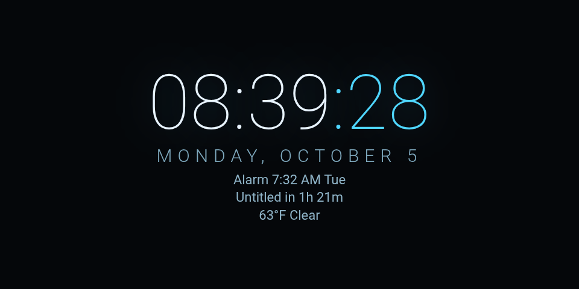
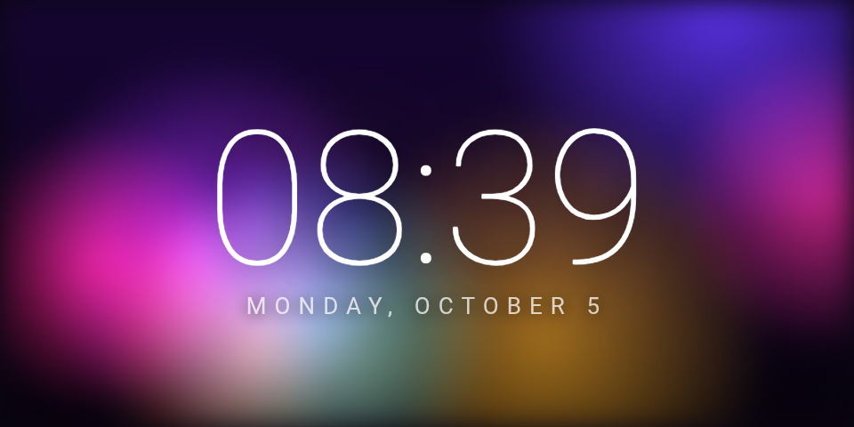
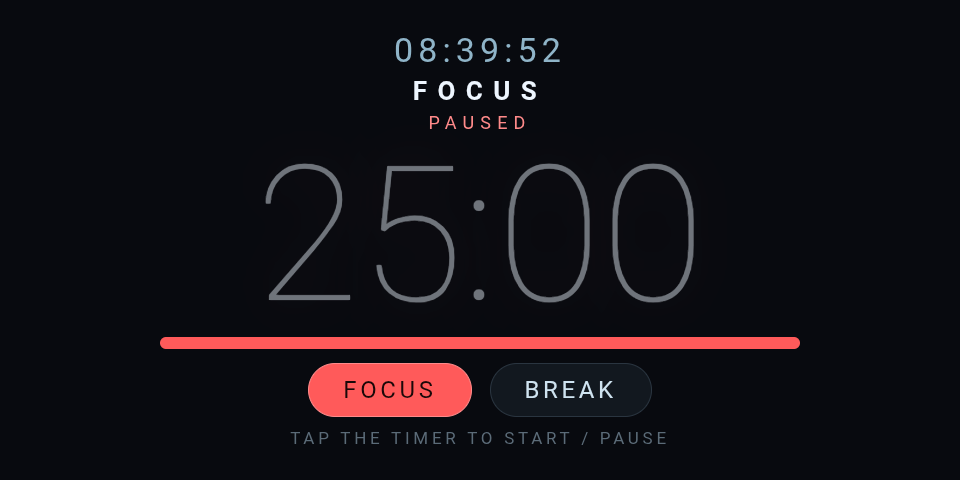
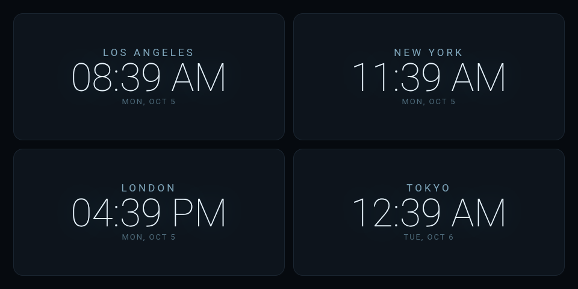
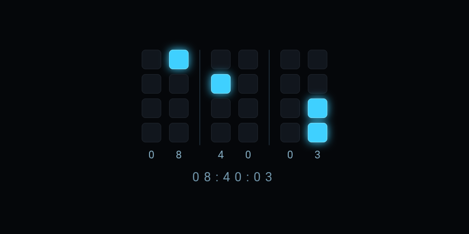
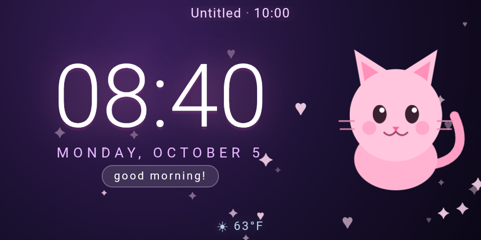
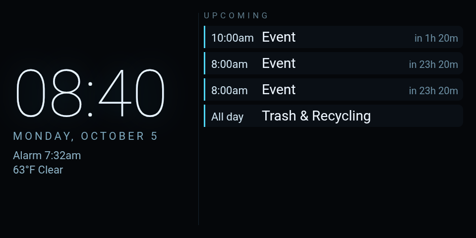

# EchoClock

Turn an **Amazon Echo Show 5 (2nd gen, 2021 — codename `cronos`)** into a private,
offline-first **desk clock launcher** on LineageOS 18.1 (Android 11): swipeable HTML/JS clock
faces with per-face settings, an app drawer, calendar events, alarms and local weather.
No account, no cloud — nothing leaves the device.

## The four parts

| # | Part | For |
|---|---|---|
| 1 | **[docs/SETUP.md](docs/SETUP.md)** — a blank device → LineageOS + GApps + EchoClock | whoever flashes the hardware |
| 2 | **[docs/USAGE.md](docs/USAGE.md)** — living with a ready device | whoever uses the clock |
| 3 | **The APK** — [download from GitHub Releases](https://github.com/konsumer/echoclock/releases/latest) (built by CI on tags `v*`) | — |
| 4 | **[docs/CUSTOMIZE.md](docs/CUSTOMIZE.md)** — new clock faces, per-face settings, external triggers | programmers |

## Quick start

```sh
git clone https://github.com/konsumer/echoclock && cd echoclock

# 0) amonet unlock bundle is login-gated on XDA — download it manually:
#    https://xdaforums.com/t/unlock-root-twrp-unbrick-amazon-echo-show-5-2nd-gen-2021-cronos.4772596/
#    -> install/dl/amonet-cronos-v2.0.1.zip

./install/download.sh        # ROM + GApps (+ builds the APK if a JDK/SDK is present)
./install/flash-lineageos.sh # unlock (amonet) + TWRP + LineageOS 18.1 + GApps
./install/provision.sh       # kiosk settings, install APK, push config, set as HOME
```

`install/setup.sh -s <serial>` runs all three per device — see [docs/SETUP.md](docs/SETUP.md)
for the details, requirements, and the **anti-rollback brick warning** you must read before
flashing.

## What you get

- **Ten bundled clock faces** — `agenda`, `analog`, `binary`, `cute`, `digital`, `flip`,
  `gallop`, `lava`, `pomodoro`, `world` — swiped left/right. A face is just an `index.html` +
  `face.json` directory, so you can write your own and drop it in
  ([faces/README.md](faces/README.md)).
- **Per-face settings** — long-press the clock; the native sheet is generated from the face's
  declared schema, checkboxes and all ([DESIGN §7.1](docs/DESIGN.md)).
- **An app drawer** — tap the clock for a scrollable grid of every installed app; **Home**
  returns to the clock.
- **On the clock today** — upcoming **calendar** events, the **next alarm** (hands off to the
  system Clock app) and local **weather** (open-meteo.com, no API key, cached on disk), plus a
  dedicated **`agenda`** face ([DESIGN §8](docs/DESIGN.md)).
- **Seven external actions** — `face:<id>`, `app:<pkg>`, `nextFace`, `prevFace`, `openDrawer`,
  `weather:refresh`, `calendar:refresh` over adb, Tasker or Home Assistant
  ([DESIGN §7.3](docs/DESIGN.md)).

**ABI note:** the SoC is 64-bit but LineageOS on `cronos` ships a **32-bit (`armeabi-v7a`)
userspace**, so the ROM, GApps and any third-party APK you bundle are ARM/32-bit
([docs/DEVICE.md](docs/DEVICE.md)). EchoClock itself is pure Kotlin with no native code, and it
needs no root.

## Screenshots

All ten bundled faces, on a real Echo Show 5 (960×480) — calendar events, next alarm and local
weather all live.

| | | | | |
|---|---|---|---|---|
| <br>**gallop** | <br>**digital** | <br>**flip** | <br>**analog** | <br>**lava** |
| <br>**pomodoro** | <br>**world** | <br>**binary** | <br>**cute** | <br>**agenda** |

## Layout

```
install/   config.env (pinned ROM/GApps versions) + download/flash/provision/setup scripts
app/       EchoClock Android app (Kotlin, Gradle wrapper) + assets/faces/ (10 bundled faces)
config/    default config.json pushed to the device
docs/      SETUP, USAGE, CUSTOMIZE + DESIGN (contract), DEVICE, GOTCHAS, screenshots/
faces/     drop-in dir for your own faces (faces/README.md)
apps/      optional third-party APKs for provision.sh (armeabi-v7a only; none enabled by default)
.github/   CI that builds EchoClock.apk and attaches it to Releases
AGENTS.md  guide for AI coding agents working in this repo
LICENSE    MIT
```

## Caveats

- **The camera works** once GApps is installed (open the app drawer → **Camera**).
- **SELinux is permissive** and the LineageOS port is **unofficial/experimental** — don't keep
  secrets on it.
- **Battery always reads 100%** and **deep sleep is disabled** — it's a wall-powered panel.
- Only the optional weather and any calendar account you sign in yourself use the network.

## Credits / prior art

- **LineageOS port** — bengris32, R0rt1z2, FieryFlames ([amazon-oss/releases](https://github.com/amazon-oss/releases)).
- **amonet** — R0rt1z2 ([github](https://github.com/R0rt1z2/amonet)); original BROM exploit lineage by xyz/k4y0z.
- **TWRP** for `cronos` — R0rt1z2 / amazon-oss.
- **Community playbooks** that informed the installer — `dallanwagz/echo-show-jailbreak`,
  `revjmoney/oHce-checkmate-3ch0`, Derek Seaman's guide, DroidWin, and the XDA threads.

Not affiliated with Amazon, LineageOS, Google, or the tool authors. Use on hardware you own.

## License

[MIT](LICENSE) © 2026 David Konsumer.
