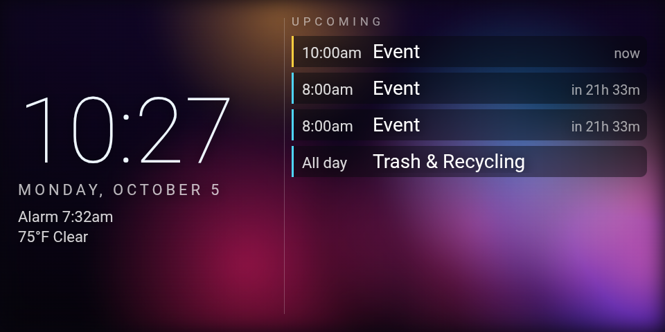

# Custom clock faces

Drop any additional clock faces in this directory and
[`install/provision.sh`](../install/provision.sh) copies each directory to
`/sdcard/EchoClock/faces/` on the device. The ten bundled faces ship inside the APK, so you only
need this folder for faces you want the installer to push — add `faces/<id>/` yourself.

**Included example:** `lava-agenda/` — the bundled `lava` background with the bundled `agenda`
data (time, next alarm, weather, upcoming events) on top. It ships here rather than in the APK,
so `install/provision.sh` is what puts it on a device.



A face is a directory containing:

```
<id>/
  face.json      # manifest: {"id","name","author","description","settings":[...]}
  index.html     # entry point (self-contained: inline CSS/JS, no network)
```

Faces use the `window.ec` script API: `config(cfg)` once on load (and again after a settings
change) and `tick(state)` once per second. The state carries `epoch`, battery/charging, `face`,
`locale`, `brightness`, plus optional `nextAlarm`, `calendar` and `weather` — guard for those.

```html
<script>
  window.ec = {
    config(cfg) { /* per-face config from config.json */ },
    tick(state) {
      // state.epoch, state.battery, state.face,
      // state.nextAlarm, state.calendar, state.weather ...
      document.getElementById('t').textContent =
        new Date(state.epoch).toLocaleTimeString();
    }
  };
</script>
```

- **Authoring guide + worked example:** [CUSTOMIZE.md](../docs/CUSTOMIZE.md) §1.
- **Interface contract** (`face.json`, `state` fields, `window.EC`, settings types):
  [DESIGN.md](../docs/DESIGN.md) §2.4, §7.1 and §8.2.

Faces placed here with the same `id` as a bundled face **override** it. Because faces are
just HTML files on `/sdcard`, you can edit them live with any file manager or over
`adb push` without rebuilding the app or rebooting:

```sh
adb push faces/mycustom /sdcard/EchoClock/faces/
```

Then **swipe** to it (user faces come first, then bundled faces, alphabetical by name), switch
from JS with `window.EC.setFace('mycustom')`, or trigger `face:mycustom` externally (see
[CUSTOMIZE.md](../docs/CUSTOMIZE.md) → *Trigger an action from outside*).
